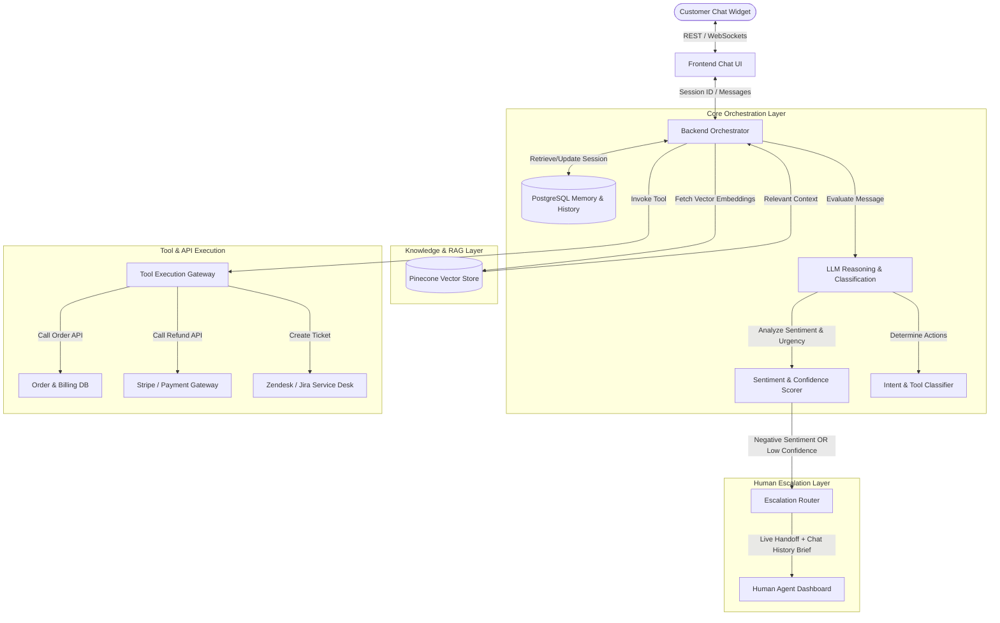
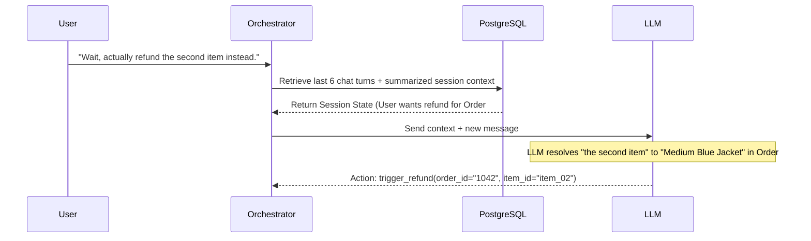

# Comprehensive Design Plan: AI-Powered Customer Care Assistant

This document outlines the detailed system architecture, core features, user experience design, and technical implementation strategies for the **Flowzint AI Customer Care Assistant**.

The primary objective of this system is to replicate the competence, memory, and judgment of a high-performing human support agent, resolving the common pitfalls of static, memoryless FAQ bots.

---

## 1. System Architecture

The following diagram illustrates the high-level system architecture and how requests flow through the orchestrator to resolve customer queries.

### Detailed Sequential Flow
1. **User Input:** A customer sends a message through the widget.
2. **Context Retrieval:** The Orchestrator queries PostgreSQL to load the sliding window chat history and long-term user profile summary.
3. **Reasoning & Scoring (LLM):** The orchestrator sends the user message, session history, and system instructions to the LLM to classify intent, extract parameters, and evaluate sentiment.
4. **Action Branching:**
   - **Scenario A (RAG):** If the query is informational, the system queries Pinecone for product/policy embeddings, grounds the LLM, and responds.
   - **Scenario B (Tool Calling):** If the query requires action (e.g., refund), the LLM outputs a structured tool call. The Tool Gateway validates, executes the backend API, feeds results back to the LLM, and a response is synthesized.
   - **Scenario C (Escalation):** If confidence is below 70%, or sentiment detects severe frustration, the Escalation Router triggers a seamless handover to a human.

---

## 2. Core Features & Mechanics

### A. Context-Aware Conversation (Memory Management)
Traditional bots treat every message as an isolated event. Flowzint utilizes a hybrid memory structure:

*   **Session-Level Memory (Sliding Window):** Stores the raw text of the last $N$ turns (typically 6-8) directly in PostgreSQL to maintain immediate conversation flow.
*   **Semantic Memory (Summarization):** As the conversation progresses, a background task periodically summarizes key points (e.g., *Customer is seeking a refund for Order #9842 due to a sizing issue*) and stores it in the session metadata.
*   **Profile-Level Memory:** Integrates with CRM data to know who the user is from the start (e.g., membership tier, lifetime value, history of recent escalations) to customize tone and options.

### B. Sentiment-Aware Escalation
Instead of waiting for a user to type "agent" or "representative," the system actively monitors for escalation triggers.

*   **Frustration Detection:** The sentiment scoring module runs in parallel with intent classification. It detects negative sentiment, high urgency, capital letters (yelling), and repeating patterns (the customer asking the same thing three times).
*   **Confidence Thresholds:** If the LLM's classification confidence drops below 0.7 (e.g., ambiguous or out-of-domain queries), the system routes the user to a human rather than guessing and hallucinating.
*   **Human Agent Context Briefing:** When escalating, the human agent does not receive a blank slate. The system generates a 3-bullet **Context Summary** for the human agent dashboard:
    *   *Issue:* Refunding item in Order #1042.
    *   *Blocker:* Customer claims package arrived damaged; refund policy requires photos, which customer refuses.
    *   *Current Sentiment:* Highly frustrated (Score: 0.15/1.0).

### C. Tool-Using Capabilities (Actionable API Integration)
The assistant does not merely chat; it executes. This is achieved using structured **Function Calling**:

*   **API Schema Definition:** Tools are described to the LLM using JSON schemas (defining parameters, types, and descriptions).
*   **Deterministic Validation:** The orchestrator intercepts the tool call generated by the LLM and validates parameters (e.g., checks if `order_id` matches regex `^\d{4,8}$`) before hitting backend systems.
*   **Safe-Write Protocols:** Critical operations like refunds (`initiate_refund`) or cancellations require dual-phase validation or a visual confirmation step in the frontend UI.

### D. Multi-Turn Resolution (Clarifying Dialogues)
Rather than failing when information is missing, the agent behaves like a human agent, engaging in dialogue to collect slots:

*   **Slot Filling:** If a customer says "I want to track my order," the agent checks its required parameters.
    *   *Required:* `order_id`
    *   *Action:* Instead of executing a search, the agent asks: *"I'd be happy to check that for you! Could you please provide your 6-digit Order ID?"*
*   **Context Retention during Clarification:** If the user deviates during slot filling (e.g., *"Wait, is shipping free anyway?"*), the agent answers the shipping question and then seamlessly steers back: *"By the way, did you still want me to track that order? If so, what was the Order ID?"*

---

## 3. Mitigating FAQ Bot Pitfalls

| Pitfall | Static FAQ Bot | Flowzint AI Customer Care Assistant |
| :--- | :--- | :--- |
| **Loss of Context** | Resets context every turn; fails to resolve pronouns like "it", "that", "the first one". | Employs sliding-window session context and coreference resolution. |
| **Repetitive Answers** | Loops infinitely when it doesn't understand, giving the same response. | Detects repeating intent queries and automatically escalates to a human on the 2nd loop. |
| **Lack of Action** | Tells the customer *how* to refund, forcing them to navigate manually. | Calls backend APIs directly to process refunds, update addresses, or create tickets. |
| **Abrupt Failures** | Hard-crashes or says "I don't understand" with no route to human help. | Handles out-of-scope queries gracefully by routing to the live chat queue with full history. |
| **Rigid Synonyms** | Only triggers if exact keywords like "damaged" are matched. | Uses semantic embedding matching (Pinecone) and LLM reasoning to capture intent variations. |

---

## 4. Real-Time User Experience (UX) Flow

A premium customer experience requires transparency, real-time response, and smooth transition states.

1.  **Typing & Action Indicators:**
    *   When searching the knowledge base, the bot displays: `🔍 Searching documentation...`
    *   When calling a tool, it displays: `⚙️ Validating order status...`
    *   This sets appropriate expectations and reduces perceived latency.
2.  **Streaming Responses:**
    *   Text is streamed token-by-token using Server-Sent Events (SSE) or WebSockets to make the interaction feel alive and immediate.
3.  **Visual Confirmation Cards:**
    *   Instead of raw text output for actions, the UI renders rich components. For example, a successful order lookup displays a shipping progress bar and product image card, rather than a block of JSON-like text.
4.  **Seamless Handoff Transition:**
    *   When handoff occurs, the chat window displays: `🤝 Connecting you to a Support Specialist. They'll have access to our chat summary so you won't have to repeat yourself.`
    *   This eliminates the number-one complaint of customers transferring to live agents.

---

## 5. Technology Stack Overview

To implement this design, we recommend the following modern, high-performance stack:

| Component | Technology | Rationale |
| :--- | :--- | :--- |
| **Frontend Chat Widget** | React + Tailwind CSS | Highly modular component state management; Tailwind allows building smooth, glassmorphic widgets. |
| **Backend API Gateway** | Node.js + Express (or FastAPI) | Excellent asynchronous performance for handling WebSockets and webhook listeners. |
| **LLM & Reasoning Engine** | Groq API (Llama 3.1 70B / 8B) | Groq offers sub-second response times, essential for real-time streaming customer care. |
| **Embedding & RAG Engine** | Pinecone + text-embedding-3-small | Serverless vector database that scales seamlessly to fetch context within milliseconds. |
| **Database & Session Cache** | PostgreSQL (Supabase) | Handles long-term chat persistence, user profile caching, and session summaries. |
| **Escalation Queue Sync** | Redis | Facilitates real-time pub/sub message routing between customers and human support dashboards. |
| **Communication Layer** | WebSockets (Socket.io) | Low-overhead bidirectional channels for live chat and typing status indicators. |
